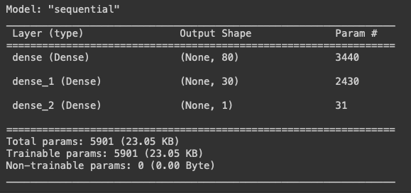
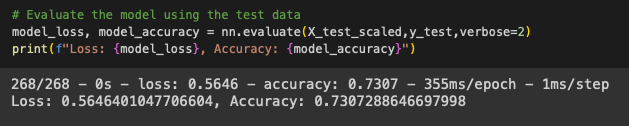
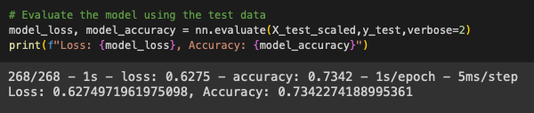

# Generating a Binary Classifier for Selecting Applicants for Alphabet Soup to Fund Based on Predicted Success

## Purpose of the Analysis
This exercise looks at data on applications for funding as submitted to the nonprofit foundation Alphabet Soup.
All applicants in this dataset have received funding already and there is no representation of applicants who were rejected, and whether they went on to succeed or not.
The data includes the following dimensions of metadata:

- EIN and NAME—Identification columns
- APPLICATION_TYPE—Alphabet Soup application type
- AFFILIATION—Affiliated sector of industry
- CLASSIFICATION—Government organization classification
- USE_CASE—Use case for funding
- ORGANIZATION—Organization type
- STATUS—Active status
- INCOME_AMT—Income classification
- SPECIAL_CONSIDERATIONS—Special considerations for application
- ASK_AMT—Funding amount requested
- IS_SUCCESSFUL—Was the money used effectively

Alphabet Soup does not want their funding to be wasted on applicants who are not likely to achieve success, so they want a model that will predict which applicant will be successful.

## Developing the Model: Analysis Questions
### Data Processing
- What variable(s) are the target(s) for your model?
    - The target for the model is the binary measure `IS_SUCCESSFUL`.

- What variable(s) are the features for your model?
    - Variables include `APPLICATION_TYPE`, `AFFILIATION`, `CLASSIFICATION`, `USE_CASE`, `ORGANIZATION`, `STATUS`, `INCOME_AMT`, `SPECIAL_CONSIDERATIONS`, and `ASK_AMT`.
    - The features `APPLICATION_TYPE` and `CLASSIFICATION` contained many different unique values, so the long tail of each was bucketed as `Other`.

- What variable(s) should be removed from the input data because they are neither targets nor features?
    - Both `EIN` and `NAME` are neither targets nor features.

### Compiling, Training, and Evaluating the Model
- How many neurons, layers, and activation functions did you select for your neural network model, and why?
    - For the initial model, three layers were selected. The first two hidden layers used rectified linear units and the output layer used a sigmoid activation function. ReLU was chosen for the first two layers because it requires much less time to train and the number of nodes in each layer is relatively high. Relying on ReLU allows the model to converge fairly quickly above 70% accuracy. The layers used the following number of neurons:
    - 

- Were you able to achieve the target model performance?
    - While the model converged quickly it did not meet target performance of 75% accuracy. Below are the results of the original model and the optimized model.
    - Original: 
    - Optimized: 

- What steps did you take in your attempts to increase model performance?
    - To optimize the model, the number of hidden layers was increased by 1, the number of neurons on the second layer was increased by 30, and the number of epochs on which the model was trained was increased by 50.

## Results
Neither the optimized model nor the original model reached the target accuracy, but both came close, 0.7342 and 0.7307, respectively.
To meet the optimization goals, an attempt was made to use the Keras Tuner to identify the best optimization.
Unfortunately, this process took too long and could not be completed on the free Google Colab tier in a reasonable amount of time.
Likely, with more compute resources, the model would be able to hit the target 75% accuracy.

## Continuing On
This model used a neural network to generate a binary classifier, but there are other models that would also be useful.
One choice would be a decision tree classifier.
The main benefit of this model is that the choice nodes may be visibly expressed.
Alphabet Soup, being a charity, is likely as concerned with how a decision is being reached as it is with whether the decision is likely to result in success.
The major downside of this approach is that a decision tree is unstable to noise or changes in the data.
A new tree would have to be generated as data with each new funding round for it to remain a good predictor.
